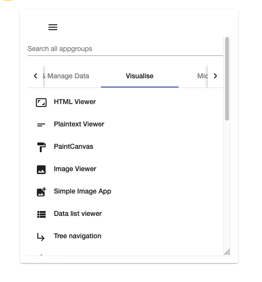
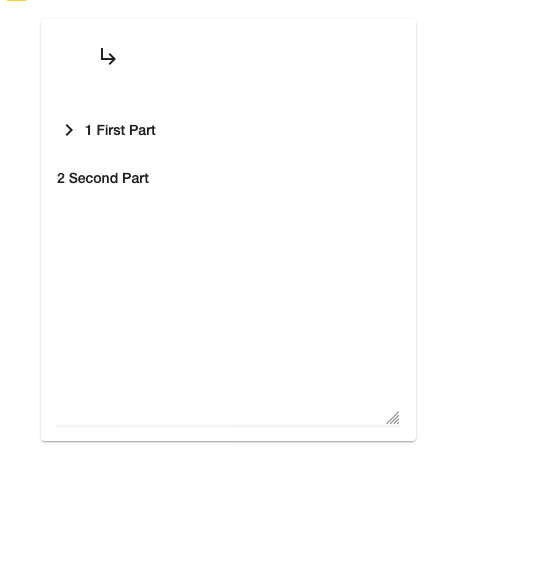
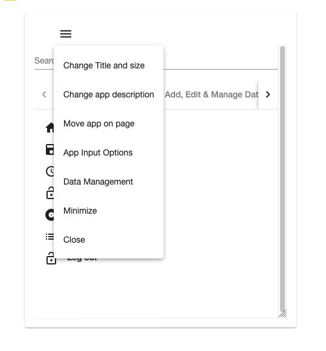
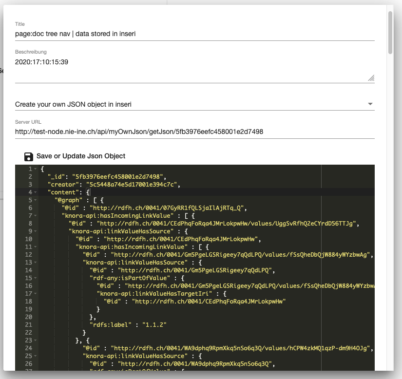
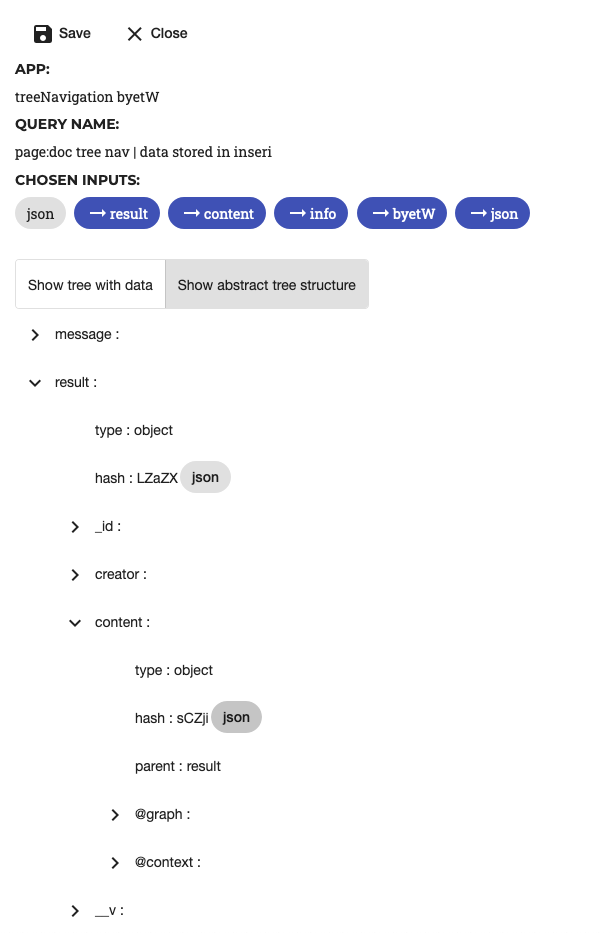
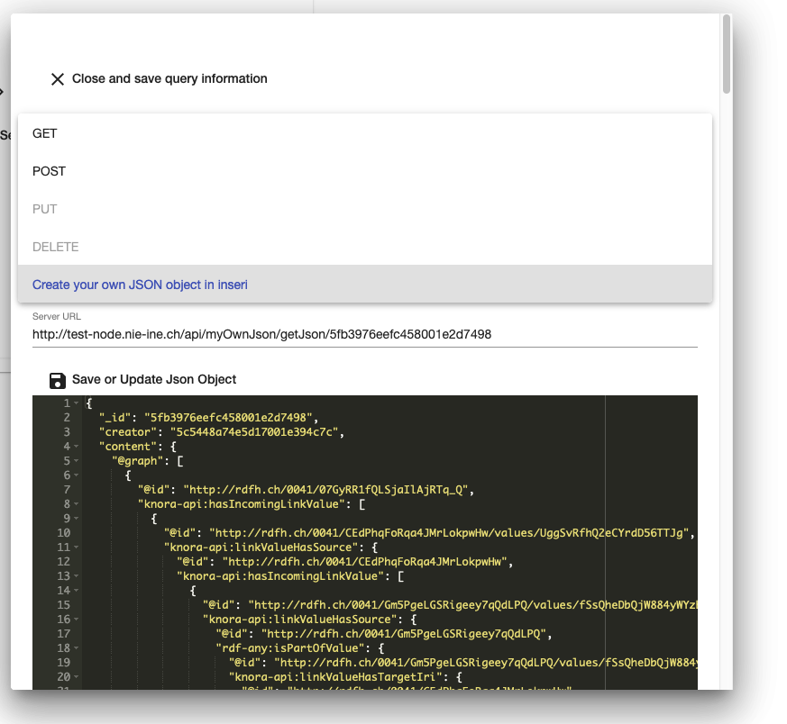

## Tree Navigation

The Tree Navigation App makes it possible to show several Knora resources that are in a hierarchy on one page.
The selected path through for example section, chapter and subchapter is represented in the URL and can easily 
be shared this way.


The typical use is a table of contents where the lower level are connected to the upper level with a property
similar to isPartOf.
All the nodes in this table of contents are clickable and the selection can be made available to other components.

This app expects special knowledge of the used ontology in Knora and the query parameters in the URL.
It does not just show data but it has the aim to enable interaction with data through different apps.

This app uses the [Angular Material Tree](https://material.angular.io/components/tree/overview) that brings in 
predefined behaviours as the toggling of subtrees.

### Using the app

To open the tree navigation, open the menu by clicking the lighthouse, then navigate to the tab "Visualise" and click on 
"Tree navigation":



This opens the app with default data:



### Configuration

The default input for `queryResponse` is a JSON tree with Knora-flavoured JSON-LD with the depending resources located in a list of
lists.

```json
{
    "@graph" : [ {
      "@id" : "http://rdfh.ch/0041/07GyRR1fQLSjaIlAjRTq_Q",
      "knora-api:hasIncomingLinkValue" : [ {
        "@id" : "http://rdfh.ch/0041/CEdPhqFoRqa4JMrLokpwHw/values/UggSvRfhQ2eCYrdD56TTJg",
        "knora-api:linkValueHasSource" : {
          "@id" : "http://rdfh.ch/0041/CEdPhqFoRqa4JMrLokpwHw",
          "knora-api:hasIncomingLinkValue" : [ {
            "@id" : "http://rdfh.ch/0041/Gm5PgeLGSRigeey7qQdLPQ/values/fSsQheDbQjW884yWYzbwAg",
            "knora-api:linkValueHasSource" : {
              "@id" : "http://rdfh.ch/0041/Gm5PgeLGSRigeey7qQdLPQ",
              "rdf-any:isPartOfValue" : {
                "@id" : "http://rdfh.ch/0041/Gm5PgeLGSRigeey7qQdLPQ/values/fSsQheDbQjW884yWYzbwAg",
                "knora-api:linkValueHasTargetIri" : {
                  "@id" : "http://rdfh.ch/0041/CEdPhqFoRqa4JMrLokpwHw"
                }
              },
              "rdfs:label" : "1.1.2"
            }
          }, {
            "@id" : "http://rdfh.ch/0041/WA9dphq9RpmXkq5nSo6q3Q/values/hCPW4zkMQ1qzP-dm9H4OJg",
            "knora-api:linkValueHasSource" : {
              "@id" : "http://rdfh.ch/0041/WA9dphq9RpmXkq5nSo6q3Q",
              "rdf-any:isPartOfValue" : {
                "@id" : "http://rdfh.ch/0041/WA9dphq9RpmXkq5nSo6q3Q/values/hCPW4zkMQ1qzP-dm9H4OJg",
                "knora-api:linkValueHasTargetIri" : {
                  "@id" : "http://rdfh.ch/0041/CEdPhqFoRqa4JMrLokpwHw"
                }
              },
              "rdfs:label" : "1.1.1"
            }
          } ],
          "http://api.knora.org/ontology/shared/literature/v2#isPartOfVerseSongbookValue" : {
            "@id" : "http://rdfh.ch/0041/CEdPhqFoRqa4JMrLokpwHw/values/UggSvRfhQ2eCYrdD56TTJg",
            "knora-api:linkValueHasTargetIri" : {
              "@id" : "http://rdfh.ch/0041/07GyRR1fQLSjaIlAjRTq_Q"
            }
          },
          "rdfs:label" : "1.1 Preface"
        }
      }, {
        "@id" : "http://rdfh.ch/0041/wGhv_G4WRY6oFheTUKfe0g/values/4DnXHLSrTQ-GISigvqI61w",
        "knora-api:linkValueHasSource" : {
          "@id" : "http://rdfh.ch/0041/wGhv_G4WRY6oFheTUKfe0g",
          "knora-api:hasIncomingLinkValue" : [ {
            "@id" : "http://rdfh.ch/0041/DjQku61RQqSw0pb6v0wubg/values/AMLosisfT2es99L_glnEpg",
            "knora-api:linkValueHasSource" : {
              "@id" : "http://rdfh.ch/0041/DjQku61RQqSw0pb6v0wubg",
              "rdf-any:isPartOfValue" : {
                "@id" : "http://rdfh.ch/0041/DjQku61RQqSw0pb6v0wubg/values/AMLosisfT2es99L_glnEpg"
              },
              "rdfs:label" : "1.2.1"
            }
          }, {
            "@id" : "http://rdfh.ch/0041/pPyHJDIiQIm-t1GJtdd_KQ/values/BGNpnIcrTP6qEWOQjsKEUw",
            "knora-api:linkValueHasSource" : {
              "@id" : "http://rdfh.ch/0041/pPyHJDIiQIm-t1GJtdd_KQ",
              "rdf-any:isPartOfValue" : {
                "@id" : "http://rdfh.ch/0041/pPyHJDIiQIm-t1GJtdd_KQ/values/BGNpnIcrTP6qEWOQjsKEUw",
                "knora-api:linkValueHasTargetIri" : {
                  "@id" : "http://rdfh.ch/0041/wGhv_G4WRY6oFheTUKfe0g"
                }
              },
              "rdfs:label" : "1.2.2"
            }
          } ],
          "http://api.knora.org/ontology/shared/literature/v2#isPartOfVerseSongbookValue" : {
            "@id" : "http://rdfh.ch/0041/wGhv_G4WRY6oFheTUKfe0g/values/4DnXHLSrTQ-GISigvqI61w",
            "knora-api:linkValueHasTargetIri" : {
              "@id" : "http://rdfh.ch/0041/07GyRR1fQLSjaIlAjRTq_Q"
            }
          },
          "rdfs:label" : "1.2 Introduction"
        }
      } ],
      "rdfs:label" : "1 First Part"
    }, {
      "@id" : "http://rdfh.ch/0041/KJ7tU9IwSZyFL90cLp0-dQ",
      "rdfs:label" : "2 Second Part"
    } ],
    "@context" : {
      "rdf" : "http://www.w3.org/1999/02/22-rdf-syntax-ns#",
      "knora-api" : "http://api.knora.org/ontology/knora-api/v2#",
      "rdfs" : "http://www.w3.org/2000/01/rdf-schema#",
      "xsd" : "http://www.w3.org/2001/XMLSchema#"
    }
}
```

This JSON object can be changed in the data management which can be reached by first cklicking the lighthouse icon, 
which should open the settings.
There, click the hamburger menu and select the entry "Data Management":



Open data management:


The button "page:<project name> | data stored in inseri" leads you to the configuration of the query.

#### Static data

Here you can copy a JSON object similar as above in a new variable `content`. Make sure to add a comma after the 
object to keep the JSON structure valid.



You can then save the configuration by clicking on "Save or Update JSON Object" and close the query configuration view
by clicking the X-button above.

The last step is to map the JSON object to the input of the tree navigation.
For this, on the data management view, click "map":

 

This opens the mapping view where you can navigate to the data inserted above by
"Show abstract tree structure", "> result", "> content"

Selecting the button "json" on the second line below "v content", sets the input.

On the top of the view, "chosen inputs" should now show: "json" "-> result" "-> content".



You can now save and close the configuration.

#### Get equivalent data from Knora

Instead of setting a JSON object manually, equivalent data can be queried from a Knora instance.
The configuration is similar but instead of "Create your own JSON object in inseri" in the dropdown,
the option "POST" has to be selected:



Such an input can be generated to a GravSearch query to Knora with the following content:

```sparql
PREFIX atharvaveda: <http://0.0.0.0:3333/ontology/0041/atharvaveda/simple/v2#>
PREFIX text: <http://api.knora.org/ontology/shared/text/simple/v2#>
PREFIX literature: <http://api.knora.org/ontology/shared/literature/simple/v2#>
PREFIX rdfs: <http://www.w3.org/2000/01/rdf-schema#>
PREFIX knora-api: <http://api.knora.org/ontology/knora-api/simple/v2#>

CONSTRUCT {
    ?kanda knora-api:isMainResource true .
    ?sukta literature:isPartOfVerseSongbook ?kanda .
    ?strophe atharvaveda:isStropheOfSukta ?sukta .
} WHERE {
    ?kanda a atharvaveda:Kanda .
    OPTIONAL { 
        ?sukta a atharvaveda:Sukta .
        ?sukta literature:isPartOfVerseSongbook ?kanda .
        OPTIONAL {
            ?strophe a atharvaveda:Strophe .
            ?strophe atharvaveda:isStropheOfSukta ?sukta .
        }
    }
}
```

No IDs and labels have to be queried through extra statements as they are per default given back by Knora.

This GravSearch query has to be sent as HTTP Post request to a Knora server at the route `/v2/searchextended`.
The domain may vary, for a local install it would usually be 
`http://localhost:3333/v2/searchextended` (with full path). Enter this in "Server URL".

The GravSearch query can be entered in the "General Query Editor" as "Body".

As a last step, the response has to be mapped to the same variable as defined above for a JSON object.

### Connection to other apps

For each level in a selected path in the tree, a query parameter is added to the URL.
The parameter name follows the pattern `d<number>` where `<number>` stands for the depth.
